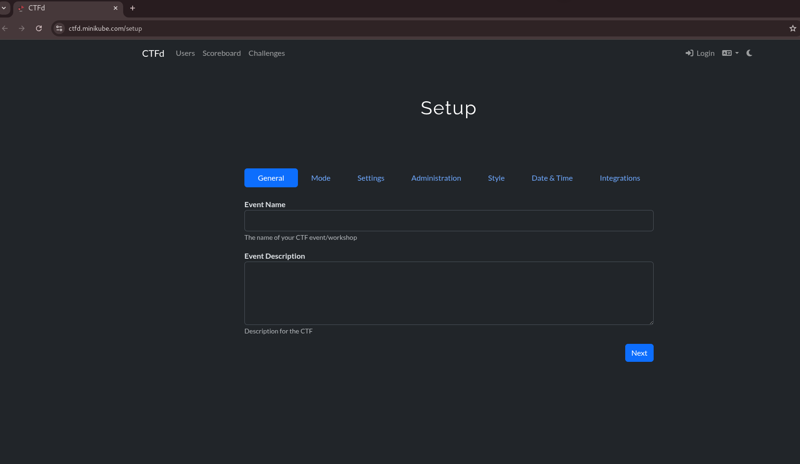
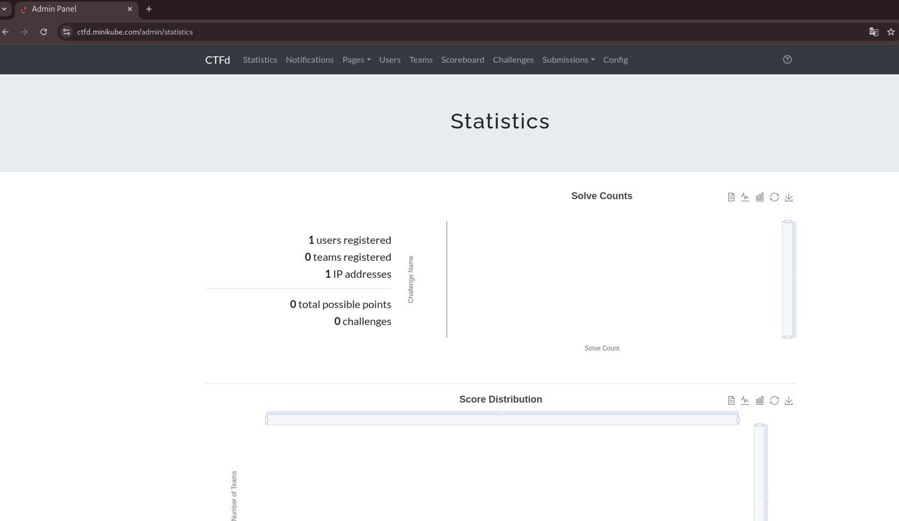

# Отчет

## Подготовка инфраструктуры

Использовался локальный кластер minikube `$ minikube start`.

В /etc/hosts добавлены записи для IP адреса minikube `$(minikube ip)`.

```hosts
192.168.49.2 ctfd.minikube.internal
```

## Установка nginx-ingress-controller

Был установлени ingress controller

```bash
minikube addons enable ingress
```

## Настройка Cert Manager

Для автоматического выпуска TLS сертификатов был установлен Cert Manager.

```bash
helm repo add jetstack https://charts.jetstack.io

helm upgrade --install cert-manager jetstack/cert-manager --namespace cert-manager --create-namespace --set crds.enabled=true
```

В файле `manifests/certificates.yaml` были описаны:

- `ClusterIssuer` - `selfsigned-issuer` объект для выпуска самоподписного сертификата, который будет использоваться в качестве удостоверяюшего центра.
- `Certificate` - `minikube-selfsigned-ca` объект представляющий открытый и закрытый ключ удостоверяющего центра, который сохраняется в секрете `root-secret`.
- `ClusterIssuer` - `minikube-ca-issuer` объект который будет выпускать сертификаты для ingress'ов на от имени удостоверяющего центра. 

Для того чтобы, сайты открывались в браузере без ошибок, нужно добавить сертификат УЦ `my-ca.crt` в доверенные на компьютере.

```bash
kubectl apply -f manifests/certificates.yaml

kubectl get secrets -n cert-manager root-secret -o jsonpath='{.data.ca\.crt}' | 
ForEach-Object { [System.Text.Encoding]::UTF8.GetString([System.Convert]::FromBase64String($_)) } | 
Out-File -Encoding ASCII my-ca.crt
```

## Развертывание кластера БД MariaDB-Galera

Используется чарт bitnami/mariadb-galera. В `mariadb-galera-values.yaml` указывается название базы данных, пользователя для подключения, параметры хранилища (storageClass, объем).

```bash
helm upgrade mariadb-galera oci://registry-1.docker.io/bitnamicharts/mariadb-galera --install --wait --namespace ctfd --create-namespace --values helm-values/mariadb-galera.yaml
```

## Развертывание Redis

Используется чарт bitnami/redis.

```bash
helm upgrade redis oci://registry-1.docker.io/bitnamicharts/redis --create-namespace --install --wait --namespace ctfd --values helm-values/redis.yaml
```

## Установка ctfd в кластер

Используется написанный helm чарт.

```bash
helm upgrade ctfd ctfd-chart --install --atomic --version 1.0.0 --wait --namespace ctfd --create-namespace --values helm-values/ctfd.yaml
```

Экран установки


Админ панель
